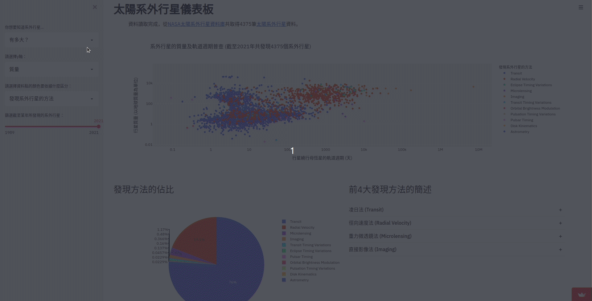

# 天文教育網頁apps - 太陽系外行星篇
[](https://share.streamlit.io/yihaosu/streamlit4astroedu-exoplanets/main/exoplanets_distance.py)
[](https://github.com/YihaoSu/streamlit4astroedu-exoplanets/blob/main/LICENSE)

此專案的apps是以[Streamlit](https://streamlit.io/)開發，並從[NASA太陽系外行星資料庫](https://exoplanetarchive.ipac.caltech.edu/)抓取資料。此專案也提供[Jupyter notebook教材](./data_access_and_visualization.ipynb)供教學使用。

[:coffee: 贊助一杯咖啡 支持我的創作 讓天文更開放 拉近群眾與星空的距離](https://liker.land/astrobackhacker/civic)

- [在Streamlit-sharing上玩此專案的apps](#在Streamlit-sharing上玩此專案的apps) 
- [在自己的電腦上運行此專案的apps](#在自己的電腦上運行此專案的apps)

## 在[Streamlit-sharing](https://streamlit.io/sharing)上玩此專案的apps

| [太陽系外行星儀表板](https://share.streamlit.io/yihaosu/streamlit4astroedu-exoplanets/main/exoplanets_dashboard.py) | [歸途 - 太陽系外行星篇](https://share.streamlit.io/yihaosu/streamlit4astroedu-exoplanets/main/exoplanets_distance.py) |
|--- | :---: |
| | |


## 在自己的電腦上運行此專案的apps
### 1. 下載此專案原始碼並安裝所需Python套件
```bash
git clone https://github.com/YihaoSu/streamlit4astroedu-exoplanets.git
cd streamlit4astroedu-exoplanets
pip install -r requirements.txt
```
### 2. 執行以下指令後即可在瀏覽器運行apps
```shell
streamlit run exoplanets_distance.py # 歸途 - 太陽系外行星篇
或
streamlit run exoplanets_dashboard.py # 太陽系外行星儀表板
```